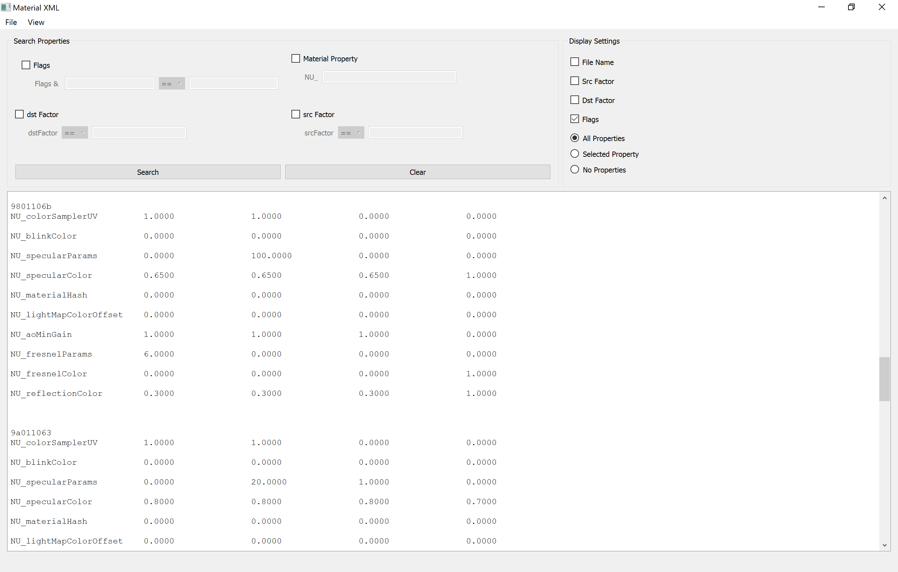

# Material-XML
   
A GUI application for analyzing XML materials exported from [Smash Forge](https://github.com/jam1garner/Smash-Forge).
A dump of XML material files for most of the models in Smash 4 for Wii U can be
found [here](https://github.com/ScanMountGoat/Sm4sh-Material-Research/blob/master/XML%20Materials/Smash%20XML%20Materials.7z).

## Credits
The application is based on the xml material import/export and NUD materials used in Smash Forge.
* [Smash Forge](https://github.com/jam1garner/Smash-Forge)
* Copyright (c) 2017 jam1garner, Ploaj, Sammi Husky, smb123w64gb, SMG
* [MIT License](https://github.com/jam1garner/Smash-Forge/blob/master/License.txt)
